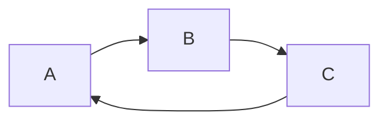

# 这是一个尝试

## 列表

---

- 有序列表：
  1. 第一步
  2. 第二步
  3. 第三步
- 无序列表：
  - 史莱姆
  - 大猩猩
  - 冰火人
- 任务列表：
  - [ ] 报名六级
  - [ ] 值班
  - [ ] 写作业

## 插入

---

### 插入代码块

```java
public class Main{
    public class void main(string[] arg){
        System.out.printf("hello world!");
    }
}
```

### 插入数学公式

$$
cos(x) = (1+cos(1/2x))/2
$$

### 插入引用

> 这是一个引用

### 插入链接

[百度](http:www.baidu.com)

### 插入表格

| name | age  | sex  |
| ---- | ---- | ---- |
| 张三 | 19   | 男   |

### 插入图片


### 插入单选框

- [ ] nan

> ???

### 表情包

:smile:

### 流程图



> LR 表示流程图从左向右；下面做解释

| 用词 | 含义     |
| ---- | -------- |
| TB   | 从上到下 |
| BT   | 从下到上 |
| LR   | 从左到右 |
| RL   | 从右到左 |

#### 常用符号

| 表述       | 说明           | 含义               |
| ---------- | -------------- | ------------------ |
| id[words]  | 矩形节点       | 过程，流程中的环节 |
| id(文字)   | 圆角矩形节点   | 开始或结束         |
| id((文字)) | 圆形节点       | 连接               |
| id{文字}   | 菱形节点说明   | 判断，决策含义     |
| id>文字]   | 右向旗帜型节点 |                    |


### 序列图


### 甘特图

> 由于绘图使用其他软件更方便傻瓜，所以我暂时不学！！！:smile:


### 数学公式


